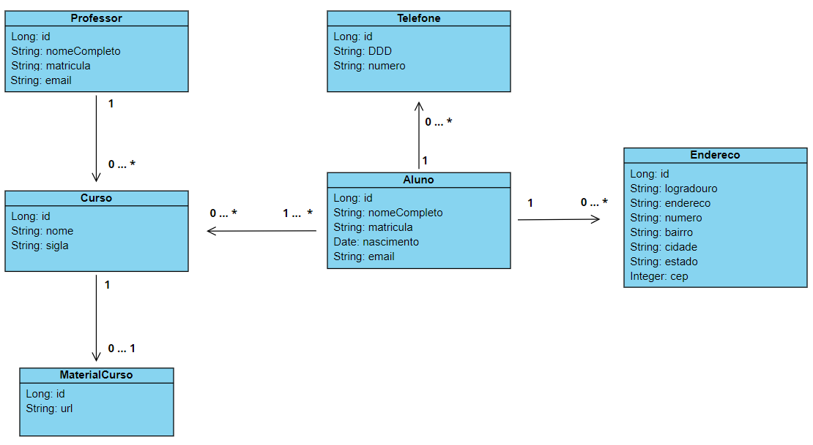

## REGRAS

#### Um aluno pode ter um ou mais endereços
#### Um aluno pode ter um ou mais telefones
#### Um professor pode lecionar vários cursos, mas um curso é lecionado por apenas um professor (muitos cursos para um professor).
#### Um curso tem apenas um material, e o material pertence apenas a um curso (um curso para um material)
#### Um curso tem apenas um professor
#### Um curso pode ter um ou mais alunos

